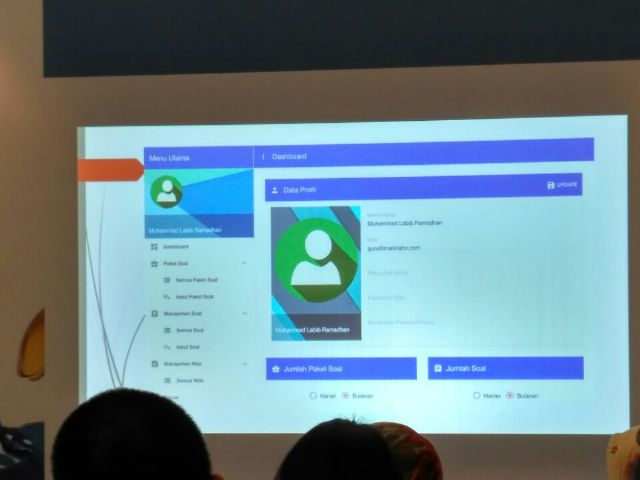
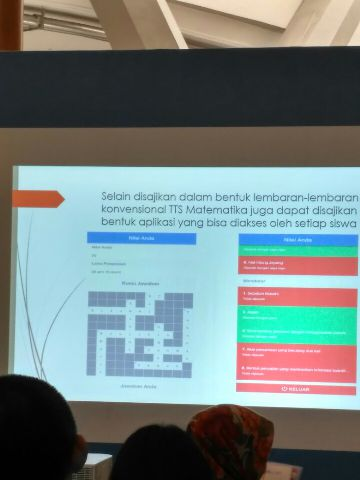

# Computer Based Test - Crossword

Created using [AngularJS Seed](https://github.com/angular/angular-seed).

[](https://david-dm.org/labibramadhan/cbt-crossword-web)
[](https://david-dm.org/labibramadhan/cbt-crossword-web?type=dev)

This is the open source version of my original project called Ujian Berbasis Komputer - Teka-teki Silang (Computer Based Test - Crossword). So this closed source project does exist since 13 September 2016. The open source version initialized on 12 January 2017. Every suspicious commercials activity of this project happened before 12 January 2017 are marked as illegal.

The differences from closed source version are:
1. Variable names translated from Indonesian to English
1. Model & code adjustments either on API Server & Mobile Application packages
1. Using ES6 & ES7 javascript language

## Table of Contents
1. [Features](#features)
    1. [Screenshots](#screenshots)
1. [Showcase](#showcase)
1. [Getting Started](#getting-started)
    1. [Prerequisites](#prerequisites)
        1. [NodeJS v6+](https://nodejs.org/en/download/)
        1. [Bower](https://bower.io/)
    1. [Installation](#installation)
    1. [Configuration](#configuration)
    1. [Testing](#testing)
    1. [Running](#running)
        1. Development
        1. Production

## Features
- [x] Participants may do the test on mobile version application. Check out the [CBT Crossword Mobile](https://github.com/labibramadhan/cbt-crossword-mobile) project
- [x] Automatically creates random crossword patterns on every participant entering the test page
- [x] Questions data can be reused on another question package
- [x] Limitation of test duration
- [x] Graph of correct & incorrect answered questions analysis (rank the most incorrect & correct answered questions)
- [x] Graph of grade average comparison each test schedules
- [x] Rank/sort participant grades based on the grade value

### Screenshots
**NOTE: Screenshots are still using the closed source version (all of them uses Indonesian language), you can hover on any screenshot image to see summarized feature in english**


## Showcase




This application has been presented on Gess Indonesia event on 15 September 2016 at [Balai Sidang Jakarta Convention Center](https://en.wikipedia.org/wiki/Jakarta_Convention_Center).

## Installation
First, download the latest released zip version of this package into your local machine. Then type these commands:
```
>_ npm install
```
```
>_ bower install
```

**NOTE: Before using this application, you have to install & configure [CBT Crossword API](https://github.com/labibramadhan/cbt-crossword-api) first**

## Configuration
Assumed you have configured and running a CBT Crossword API server package, if you have changed the connection port of the server package, you have to configure those variables:

1. ```urlBase``` variable value on [rest.js](app/components/modules/rest.js)
1. ```API_BASE``` constant value on [app-constant.js](app/app-constant.js)

## Testing
Testing for the first time, you have to download the configured Selenium WebDriver on this project by using this command:
```
>_ npm run update-webdriver
```

After the Selenium WebDriver installed, you can then execute the end-to-end test scenarios by using command:
```
>_ npm test
```

## Running

### Development
For development purpose, this project is using the benefits of [Webpack Dev Server](https://webpack.github.io/docs/webpack-dev-server.html):
- Realtime transformation using babel-loader
- Compiled bundle is easily to debug by using inline-source-map devtool option
- Auto reload the browser tabs on every files included on [index.js](app/index.js) have changed

Type this command to start the development server:
```
>_ npm run dev
```

After that, you can visit http://localhost:8585 on your browser to start using this application on development mode.

Note that you can change the configured development server port (8585) from [webpack.config.js](webpack.config.js) file.

### Production
For production purpose, you need to build the project first by using this command:
```
>_ npm run build
```

Then, you can start serving your production ready package by using this command:
```
>_ npm run serve
```

After that, you can visit http://localhost:2796 on your browser to start using this application on production mode.

Note that you can change the configured production server port (2796) from [package.json](package.json) file.